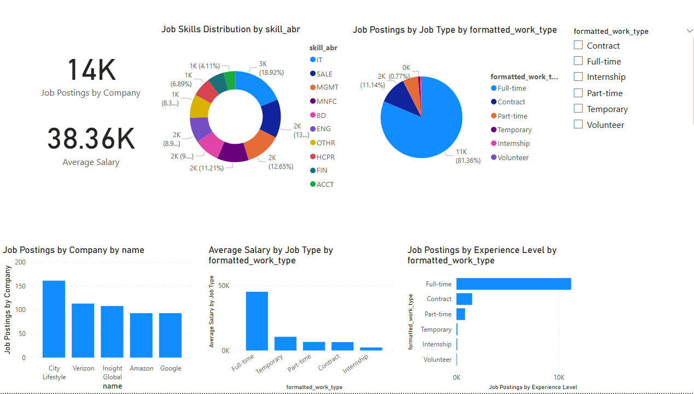
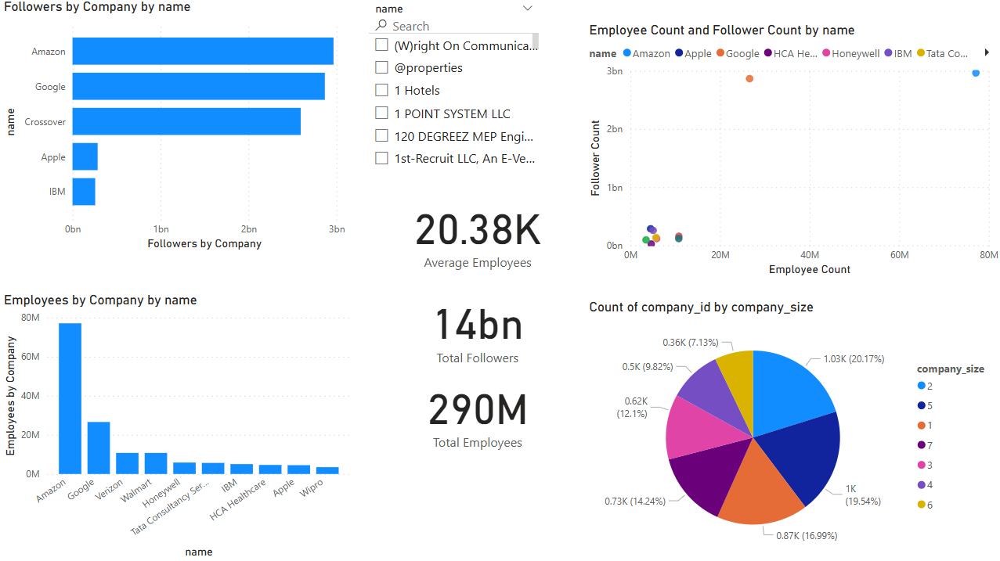
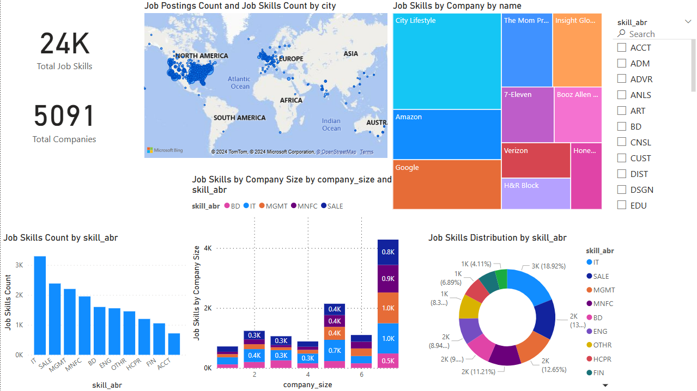
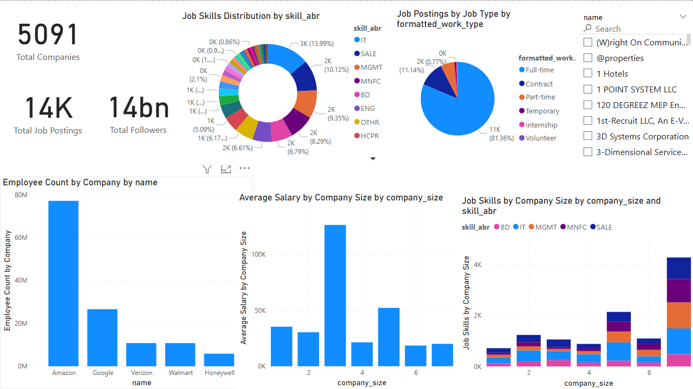

# Power BI LinkedIn Job Insights

## Overview  
This project leverages **Microsoft Power BI** to analyze job postings, employee distribution, job skills, and company performance data. Interactive dashboards provide insights into job trends, skills demand, and workforce distribution, enabling effective decision-making for businesses and stakeholders.

---

## Objectives  
1. Analyze job postings by type, company, and demand trends.  
2. Visualize workforce distribution and follower growth across companies.  
3. Assess demand for job skills and their distribution across industries.  
4. Evaluate company performance in terms of job postings, employee size, and salaries.  

---

## Tools & Technologies Used  
- **Microsoft Power BI**  
- **Data Visualization**: Interactive dashboards and reports  
- **Data Source**: LinkedIn job postings and employee data  

---

## Dashboards  

### 1. **Job Postings Overview**  
This dashboard provides an overview of job postings across companies and job types.  
- **Key Metrics**:  
  - Total Job Postings  
  - Average Salary  
- **Visualizations**:  
  - Job Postings by Company  
  - Job Type Distribution (Pie Chart)  
  - Average Salary by Job Type  

### 2. **Employee and Follower Analysis**  
This dashboard analyzes employee count, follower count, and workforce composition.  
- **Key Metrics**:  
  - Total Employees  
  - Total Followers  
  - Average Employees per Company  
- **Visualizations**:  
  - Employees by Company  
  - Followers by Company  
  - Employee Count vs. Follower Count  

### 3. **Job Skills Analysis**  
This dashboard evaluates the demand and distribution of job skills.  
- **Key Metrics**:  
  - Total Job Skills  
  - Top Demanded Skills  
- **Visualizations**:  
  - Job Skills Count by Skill Type  
  - Skill Distribution by Company and Job Type  
  - Job Skills by Company (Treemap)  

### 4. **Company Performance and Employee Distribution**  
This dashboard assesses company performance based on job postings, employee size, and salaries.  
- **Key Metrics**:  
  - Total Companies  
  - Total Job Postings  
  - Total Followers  
- **Visualizations**:  
  - Employee Count by Company  
  - Average Salary by Company Size  
  - Job Postings Distribution by Job Type  

---

## Key Insights  
1. **High-Demand Job Types**: Full-time positions dominate the job market, highlighting a preference for stable employment.  
2. **Top Companies**: Companies like **Amazon**, **Google**, and **City Lifestyle** have the highest job postings and employee counts.  
3. **Skills in Demand**:  
   - **IT Skills** are the most sought-after, followed by **Sales** and **Management**.  
4. **Company Performance**:  
   - Companies with larger workforce sizes tend to offer higher salaries.  
   - Variations exist in follower count and employee distribution, revealing opportunities to improve brand presence.  

---

## Results Visualization  
Here are snapshots of the interactive dashboards:  

- **Job Postings Overview**:  
    

- **Employee and Follower Analysis**:  
    

- **Job Skills Analysis**:  
    

- **Company Performance**:  
    

---

## Future Improvements  
1. Integrate real-time data sources for live updates on job postings.  
2. Expand analysis to include regional trends and salary distributions.  
3. Enhance dashboards with predictive analytics for job trends.  

---

## Contact  
For inquiries or collaboration, feel free to reach out:  
- **Name**: Mousa Aricat  
- **Email**: [mousa_arikat@outlook.com](mailto:mousa_arikat@outlook.com)  
- **LinkedIn**: [Mousa Aricat](https://www.linkedin.com/in/mousa-aricat-5847a2241/)
